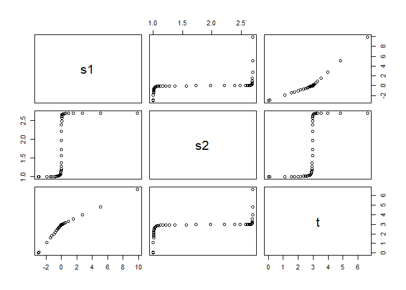
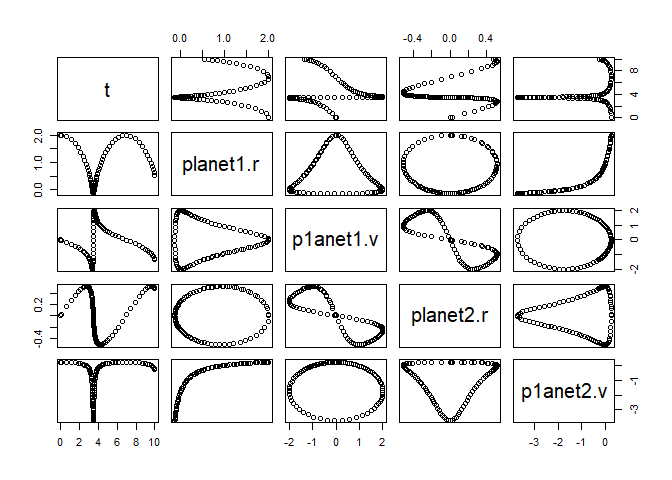
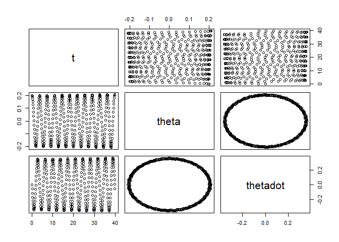
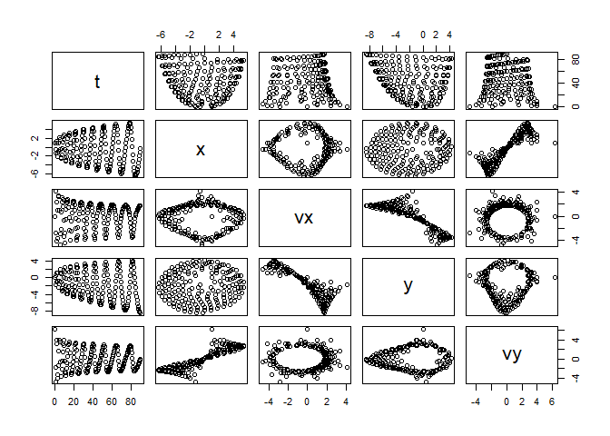
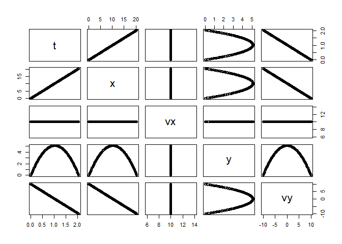
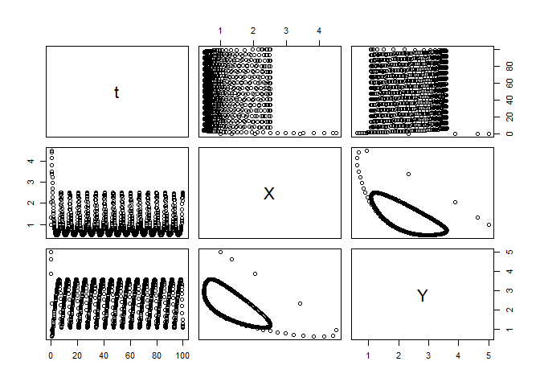
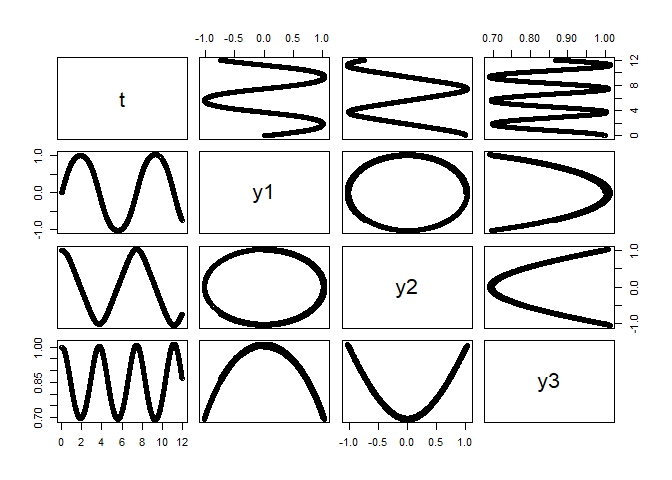

<!-- README.md is generated from README.Rmd.  -->
[](http://www.rdocumentation.org/packages/rODE)

rODE
====

The goal of `rODE` is to explore R and its `S4` classes and its differences with Java and Python classes while exploring physics simulations by solving ordinary differential equations (`ODE`).

This is not your typical black-box ODE solver. You really have to develop your ODE algorithm using any of the ODE solvers available. The objective is learning while doing.

`rODE` has been inspired on the extraordinary physics library for computer simulations **OpenSourcePhyisics**. Take a look at <http://opensourcephysics.org>.

The ODE solvers implemented in R so far:

-   Euler
-   Euler-Richardson
-   RK4
-   RK45, Dormand-Prince45
-   Verlet

Installation
------------

You can install the latest version of `rODE` from github with:

``` r
devtools::install_github("f0nzie/rODE")
```

Or from `CRAN`:

``` r
install.packages("rODE")
```

Examples
--------

Example scripts are located under the folder `examples` inside the package.

These examples make use of a parent class containing a customized rate calculation as well as the step and startup method. The methods that you would commonly find in the base script or parent class are:

-   `getRate()`
-   `getState()`
-   `step()` or `doStep()`
-   `setStepSize()`
-   `init()`, which is not the same as the `S4` class `initialize` method
-   `initialize()`, and
-   the constructor

These methods are defined in the virtual classes `ODE` and `ODESolver`.

Two other classes that serve as definition classes for the ODE solvers are: `AbstractODESolver` and `ODEAdaptiveSolver`.

For instance, the application `KeplerApp.R` needs the class `Kepler` located in the `Kepler.R` script, which is called with `planet <- Kepler(r, v)`, an `ODE` object. The solver for the same application is `RK45` called with `solver <- RK45(planet)`, where `planet` is a previuously declared `ODE` object. Since `RK45` is an ODE solver, the script `RK45.R` will be located in the folder `./R` in the package.

Vignettes
---------

The vignettes contain examples of the use of the various ODE solvers.

For instance, the notebook `Comparison` and `Kepler` use the ODE solver `RK45`; `FallingParticle` and `Planet` use the `Euler` solver; `Pendulum` makes use of `EulerRichardson`; `Planet` of `Euler`, `Projectile`; `Reaction` of `RK4`, and `KeplerEnergy` uses the ODE solver `Verlet`.

Tests
=====

There are tests for the core ODE solver classes under tests/testthat, as well as additional tests for the examples themselves.

### Test this folder

The tests for the examples are two: one for the base/parent classes such as `Kepler` or `Planet` or `Projectile`; this test runner is called `run_tests_this_folder.R`.

For the applications there is another runner (`run_test_applications.R`) that opens each of the applications as request for a return value. If the hard coded value is not returned, the test will fail. This ensures that any minor change in the core solver classes do not have any impact on the application solutions, and if there is, it must be explained.

### Tests all the application examples

You can test all applications under the `examples` folder by running the script `run_test_applications.R`. The way it works is by getting the list of all applications by filtering those ending with `App`. Then removes the extension `.R` from each app and starts looping to call each of the applications with `do.call`. A list contains the `expected` results that are compared against the result coming out from the call to the R application.

Applications
============

AdaptiveStepApp
---------------

``` r
library(rODE)
#> 
#> Attaching package: 'rODE'
#> The following object is masked from 'package:stats':
#> 
#>     step
importFromExamples("AdaptiveStep.R")

# running function
AdaptiveStepApp <- function(verbose = FALSE) {
    ode        <- new("Impulse")
    ode_solver <- RK45(ode)
    ode_solver <- init(ode_solver, 0.1)
    ode_solver <- setTolerance(ode_solver, 1.0e-4)
    i <- 1; rowVector <- vector("list")
    while (getState(ode)[1] < 12) {
        rowVector[[i]] <- list(s1 = getState(ode)[1],
                               s2 = getState(ode)[2],
                               t  = getState(ode)[3])
        ode_solver <- step(ode_solver)
        ode <- ode_solver@ode
        i <- i + 1
    }
    return(data.table::rbindlist(rowVector))
}

# run application
solution <- AdaptiveStepApp()
plot(solution)
```



ComparisonRK45App
-----------------

``` r
# ++++++++++++++++++++++++++++++++++++++++++++++++  example: ComparisonRK45App.R
# Compares the solution by the RK45 ODE solver versus the analytical solution
# Example file: ComparisonRK45App.R
# ODE Solver:   Runge-Kutta 45
# Class:        RK45
library(rODE)
importFromExamples("ODETest.R")

 ComparisonRK45App <- function(verbose = FALSE) {
     ode <- new("ODETest")                     # create an `ODETest` object
     ode_solver <- RK45(ode)                   # select the ODE solver
     ode_solver <- setStepSize(ode_solver, 1)      # set the step
     ode_solver <- setTolerance(ode_solver, 1e-8)  # set the tolerance
     time <-  0
     rowVector <- vector("list")
     i <- 1
     while (time < 50) {
         rowVector[[i]] <- list(t  = ode_solver@ode@state[2],
                                s1 = getState(ode_solver@ode)[1],
                                s2 = getState(ode_solver@ode)[2],
                                xs = getExactSolution(ode_solver@ode, time),
                                rc = getRateCounts(ode),
                                time = time)
         ode_solver <- step(ode_solver)       # advance one step
         stepSize <-  ode_solver@stepSize     # update the step size
         time <- time + stepSize
         state <- getState(ode_solver@ode)    # get the `state` vector
         i <- i + 1
     }
     return(data.table::rbindlist(rowVector))    # a data table with the results
 }
# show solution
solution <- ComparisonRK45App()                          # run the example
plot(solution)
```


FallingParticleODE
------------------

``` r
# +++++++++++++++++++++++++++++++++++++++++++++++  example: FallingParticleApp.R
# Application that simulates the free fall of a ball using Euler ODE solver
library(rODE)
importFromExamples("FallingParticleODE.R")      # source the class

FallingParticleODEApp <- function(verbose = FALSE) {
    # initial values
    initial_y <- 10
    initial_v <- 0
    dt <- 0.01
    ball <- FallingParticleODE(initial_y, initial_v)
    solver <- Euler(ball)                        # set the ODE solver
    solver <- setStepSize(solver, dt)            # set the step
    rowVector <- vector("list")
    i <- 1
    # stop loop when the ball hits the ground, state[1] is the vertical position
    while (ball@state[1] > 0) {
        rowVector[[i]] <- list(t  = ball@state[3],
                               y  = ball@state[1],
                               vy = ball@state[2])
        solver <- step(solver)                   # move one step at a time
        ball <- solver@ode                       # update the ball state
        i <- i + 1
    }
    DT <- data.table::rbindlist(rowVector)
    return(DT)
}
# show solution
solution <- FallingParticleODEApp()
plot(solution)
```


KeplerApp
---------

``` r
#  +++++++++++++++++++++++++++++++++++++++++++++++++++++++++ example KeplerApp.R
#  KeplerApp solves an inverse-square law model (Kepler model) using an adaptive
#  stepsize algorithm.
#  Application showing two planet orbiting
#  File in examples: KeplerApp.R
library(rODE)
importFromExamples("Kepler.R") # source the class Kepler

KeplerApp <- function(verbose = FALSE) {

    # set the orbit into a predefined state.
    r <- c(2, 0)                                   # orbit radius
    v <- c(0, 0.25)                                # velocity
    dt <- 0.1

    planet <- Kepler(r, v)
    solver <- RK45(planet)

    rowVector <- vector("list")
    i <- 1
    while (planet@state[5] <= 10) {
        rowVector[[i]] <- list(t  = planet@state[5],
                               planet1.r = planet@state[1],
                               p1anet1.v = planet@state[2],
                               planet2.r = planet@state[3],
                               p1anet2.v = planet@state[4])
        solver <- step(solver)
        planet <- solver@ode
        i <-  i + 1
    }
    DT <- data.table::rbindlist(rowVector)
    return(DT)
}

solution <- KeplerApp()
plot(solution)
```


KeplerEnergyApp
---------------

``` r
# ++++++++++++++++++++++++++++++++++++++++++++++++++  example: KeplerEnergyApp.R
# Demostration of the use of the Verlet ODE solver
#
library(rODE)
importFromExamples("KeplerEnergy.R") # source the class Kepler

KeplerEnergyApp <- function(verbose = FALSE) {
    # initial values
    x  <- 1
    vx <- 0
    y  <- 0
    vy <- 2 * pi
    dt <- 0.01
    tol <- 1e-3
    particle <- KeplerEnergy()
    particle <- init(particle, c(x, vx, y, vy, 0))
    odeSolver <- Verlet(particle)
    odeSolver <- init(odeSolver, dt)
    particle@odeSolver <- odeSolver
    initialEnergy <- getEnergy(particle)
    rowVector <- vector("list")
    i <- 1
    while (getTime(particle) <= 1.20) {
        rowVector[[i]] <- list(t  = particle@state[5],
                               x  = particle@state[1],
                               vx = particle@state[2],
                               y  = particle@state[3],
                               vy = particle@state[4],
                               E  = getEnergy(particle))
        particle <- doStep(particle)
        energy <- getEnergy(particle)
        i <- i + 1
    }
    DT <- data.table::rbindlist(rowVector)
    return(DT)
}


solution <- KeplerEnergyApp()
plot(solution)
```


LogisticApp
-----------

``` r
library(rODE)
importFromExamples("Logistic.R") # source the class Logistic

# Run the application
LogisticApp <- function(verbose = FALSE) {
    x  <- 0.1
    vx <- 0
    r  <- 2        # Malthusian parameter (rate of maximum population growth)
    K  <- 10.0     # carrying capacity of the environment
    dt   <- 0.01; tol  <- 1e-3; tmax <- 10
    population <- Logistic()
    population <- init(population, c(x, vx, 0), r, K)
    odeSolver <- Verlet(population)
    odeSolver <- init(odeSolver, dt)
    population@odeSolver <- odeSolver
    rowVector <- vector("list")
    i <- 1
    while (getTime(population) <= tmax) {
        rowVector[[i]] <- list(t = getTime(population),
                               s1 = population@state[1],
                               s2 = population@state[2])
        population <- doStep(population)
        i <- i + 1
    }
    DT <- data.table::rbindlist(rowVector)
    return(DT)
}
# show solution
solution <- LogisticApp()
plot(solution)
```



PendulumApp
-----------

``` r
# ++++++++++++++++++++++++++++++++++++++++++++++++++      example: PendulumApp.R
# Simulation of a pendulum using the EulerRichardson ODE solver
library(rODE)
suppressPackageStartupMessages(library(ggplot2))
importFromExamples("Pendulum.R")      # source the class

PendulumApp <- function(verbose = FALSE) {
    # initial values
    theta <- 0.2
    thetaDot <- 0
    dt <- 0.1
    ode <- new("ODE")
    pendulum <- Pendulum()
    pendulum@state[3] <- 0      # set time to zero, t = 0
    pendulum <- setState(pendulum, theta, thetaDot)
    pendulum <- setStepSize(pendulum, dt = dt) # using stepSize in RK4
    pendulum@odeSolver <- setStepSize(pendulum@odeSolver, dt) # set new step size
    rowvec <- vector("list")
    i <- 1
    while (pendulum@state[3] <= 40)    {
        rowvec[[i]] <- list(t  = pendulum@state[3],    # time
                            theta = pendulum@state[1], # angle
                            thetadot = pendulum@state[2]) # derivative of angle
        pendulum <- step(pendulum)
        i <- i + 1
    }
    DT <- data.table::rbindlist(rowvec)
    return(DT)
}
# show solution
solution <- PendulumApp()
plot(solution)
```


PlanetApp
---------

``` r
# ++++++++++++++++++++++++++++++++++++++++++++++++++++++++  example: PlanetApp.R
# Simulation of Earth orbiting around the SUn using the Euler ODE solver
library(rODE)
importFromExamples("Planet.R")      # source the class

PlanetApp <- function(verbose = FALSE) {
    # x =  1, AU or Astronomical Units. Length of semimajor axis or the orbit
    # of the Earth around the Sun.
    x <- 1; vx <- 0; y <- 0; vy <- 6.28; t <- 0
    state <- c(x, vx, y, vy, t)
    dt <-  0.01
    planet <- Planet()
    planet@odeSolver <- setStepSize(planet@odeSolver, dt)
    planet <- init(planet, initState = state)
    rowvec <- vector("list")
    i <- 1
    # run infinite loop. stop with ESCAPE.
    while (planet@state[5] <= 90) {     # Earth orbit is 365 days around the sun
        rowvec[[i]] <- list(t  = planet@state[5],     # just doing 3 months
                            x  = planet@state[1],     # to speed up for CRAN
                            vx = planet@state[2],
                            y  = planet@state[3],
                            vy = planet@state[4])
        for (j in 1:5) {                 # advances time
            planet <- doStep(planet)
        }
        i <- i + 1
    }
    DT <- data.table::rbindlist(rowvec)
    return(DT)
}

# run the application
solution <- PlanetApp()
select_rows <- seq(1, nrow(solution), 10)      # do not overplot
solution <- solution[select_rows,]
plot(solution)
```


ProjectileApp
-------------

``` r
# +++++++++++++++++++++++++++++++++++++++++++++++++ application: ProjectileApp.R
#                                                      test Projectile with RK4
#                                                      originally uses Euler
library(rODE)
importFromExamples("Projectile.R")      # source the class

ProjectileApp <- function(verbose = FALSE) {
    # initial values
    x <- 0; vx <- 10; y <- 0; vy <- 10
    state <- c(x, vx, y, vy, 0)                        # state vector
    dt <- 0.01

    projectile <- Projectile()
    projectile <- setState(projectile, x, vx, y, vy)
    projectile@odeSolver <- init(projectile@odeSolver, 0.123)
    projectile@odeSolver <- setStepSize(projectile@odeSolver, dt)
    rowV <- vector("list")
    i <- 1
    while (projectile@state[3] >= 0)    {
        rowV[[i]] <- list(t = projectile@state[5],
                          x  = projectile@state[1],
                          vx = projectile@state[2],
                          y  = projectile@state[3],     # vertical position
                          vy = projectile@state[4])
        projectile <- step(projectile)
        i <- i + 1
    }
    DT <- data.table::rbindlist(rowV)
    return(DT)
}

solution <- ProjectileApp()
plot(solution)
```



ReactionApp
-----------

``` r
# +++++++++++++++++++++++++++++++++++++++++++++++++++ application: ReactionApp.R
# ReactionApp solves an autocatalytic oscillating chemical
# reaction (Brusselator model) using
# a fourth-order Runge-Kutta algorithm.
library(rODE)
importFromExamples("Reaction.R")      # source the class

ReactionApp <- function(verbose = FALSE) {
    X <- 1; Y <- 5;
    dt <- 0.1

    reaction <- Reaction(c(X, Y, 0))
    solver <- RK4(reaction)
    rowvec <- vector("list")
    i <- 1
    while (solver@ode@state[3] < 100) {             # stop at t = 100
        rowvec[[i]] <- list(t = solver@ode@state[3],
                            X = solver@ode@state[1],
                            Y = solver@ode@state[2])
        solver <- step(solver)
        i <-  i + 1
    }
    DT <- data.table::rbindlist(rowvec)
    return(DT)
}

solution <- ReactionApp()
plot(solution)
```



RigidBodyNXFApp
---------------

``` r
# +++++++++++++++++++++++++++++++++++++++++++++++ application: RigidBodyNXFApp.R
# example of a nonstiff system is the system of equations describing
# the motion of a rigid body without external forces.
library(rODE)
importFromExamples("RigidBody.R")

# run the application
RigidBodyNXFApp <- function(verbose = FALSE) {
    # load the R class that sets up the solver for this application
    y1 <- 0   # initial y1 value
    y2 <- 1    # initial y2 value
    y3 <- 1    # initial y3 value
    dt        <- 0.01 # delta time for step

    body <- RigidBodyNXF(y1, y2, y3)
    solver <- Euler(body)
    solver <- setStepSize(solver, dt)
    rowVector <- vector("list")
    i <- 1
    # stop loop when the body hits the ground
    while (body@state[4] <= 12) {
        rowVector[[i]] <- list(t  = body@state[4],
                               y1 = body@state[1],
                               y2 = body@state[2],
                               y3 = body@state[3])
        solver <- step(solver)
        body <- solver@ode
        i <- i + 1
    }
    DT <- data.table::rbindlist(rowVector)
    return(DT)
}

# get the data table from the app
solution <- RigidBodyNXFApp()
plot(solution)
```



SHOApp
------

``` r
library(rODE)
importFromExamples("SHO.R")

# SHOApp.R
SHOApp <- function(...) {
    x <- 1.0; v <- 0; k <- 1.0; dt <- 0.01; tolerance <- 1e-3
    sho    <- SHO(x, v, k)
    solver_factory <- ODESolverFactory()
    solver <- createODESolver(solver_factory, sho, "DormandPrince45")
    # solver <- DormandPrince45(sho)                    # this can also be used
    solver <- setTolerance(solver, tolerance)
    solver <- init(solver, dt)
    i <- 1; rowVector <- vector("list")
    while (sho@state[3] <= 500) {
        rowVector[[i]] <- list(x = sho@state[1],
                               v = sho@state[2],
                               t = sho@state[3])
        solver <- step(solver)
        sho    <- solver@ode
        i <- i + 1
    }
    return(data.table::rbindlist(rowVector))
}

solution <- SHOApp()
plot(solution)
```



SpringRK4App
------------

``` r
# ++++++++++++++++++++++++++++++++++++++++++++++++++application:  SpringRK4App.R
# Simulation of a spring considering no friction
library(rODE)
importFromExamples("SpringRK4.R")

# run application
SpringRK4App <- function(verbose = FALSE) {
    theta    <- 0
    thetaDot <- -0.2
    tmax     <- 22; dt <- 0.1
    ode <- new("ODE")
    spring <- SpringRK4()
    spring@state[3] <- 0      # set time to zero, t = 0
    spring <- setState(spring, theta, thetaDot)
    spring <- setStepSize(spring, dt = dt) # using stepSize in RK4
    spring@odeSolver <- setStepSize(spring@odeSolver, dt) # set new step size
    rowvec <- vector("list")
    i <- 1
    while (spring@state[3] <= tmax)    {
        rowvec[[i]] <- list(t  = spring@state[3],      # angle
                            y1 = spring@state[1],      # derivative of the angle
                            y2 = spring@state[2])      # time
        i <- i + 1
        spring <- step(spring)
    }
    DT <- data.table::rbindlist(rowvec)
    return(DT)
}

# show solution
solution <- SpringRK4App()
plot(solution)
```



VanderpolApp
------------

``` r
# ++++++++++++++++++++++++++++++++++++++++++++++++   application: VanderPolApp.R
# Solution of the Van der Pol equation
#
library(rODE)
importFromExamples("VanderPol.R")

# run the application
VanderpolApp <- function(verbose = FALSE) {
    # set the orbit into a predefined state.
    y1 <- 2; y2 <- 0; dt <- 0.1;
    rigid_body <- VanderPol(y1, y2)
    solver <- RK45(rigid_body)
    rowVector <- vector("list")
    i <- 1
    while (rigid_body@state[3] <= 20) {
        rowVector[[i]] <- list(t =  rigid_body@state[3],
                               y1 = rigid_body@state[1],
                               y2 = rigid_body@state[2])
        solver <- step(solver)
        rigid_body <- solver@ode
        i <-  i + 1
    }
    DT <- data.table::rbindlist(rowVector)
    return(DT)
}

# show solution
solution <- VanderpolApp()
plot(solution)
```


VanderpolMuTimeControlApp
-------------------------

``` r
# +++++++++++++++++++++++++++++++++++++     example: VanderpolMuTimeControlApp.R
# This is a modification of the original Vanderpol.R script
# In this version, we will add tha ability of setting mu and time lapse.
# This example is also shown in the Matlab help guide
library(rODE)
importFromExamples("VanderpolMuTimeControl.R")

# run the application
VanderpolMuTimeControlApp <- function(verbose = FALSE) {
    # set the orbit into a predefined state.
    y1 <- 2; y2 <- 0; mu <- 10; tmax <- mu * 3; dt <- 0.01
    rigid_body <- VanderPol(y1, y2, mu)
    solver <- RK45(rigid_body)
    rowVector <- vector("list")
    i <- 1
    while (rigid_body@state[3] <= tmax) {
        rowVector[[i]] <- list(t =  rigid_body@state[3],
                               y1 = rigid_body@state[1],
                               y2 = rigid_body@state[2]
                               )
        solver <- step(solver)
        rigid_body <- solver@ode
        i <-  i + 1
    }
    DT <- data.table::rbindlist(rowVector)
    return(DT)
}

# show solution
solution <- VanderpolMuTimeControlApp()
plot(solution)
```


